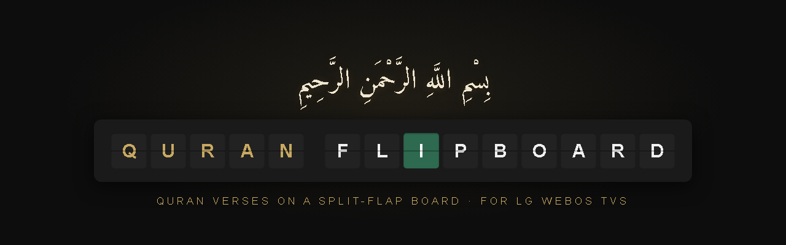
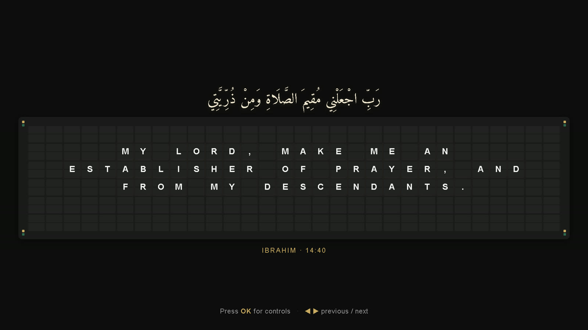
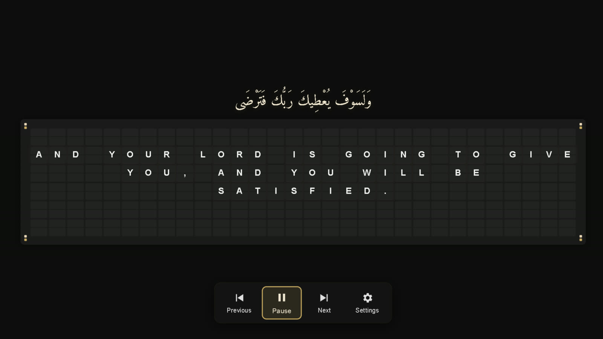
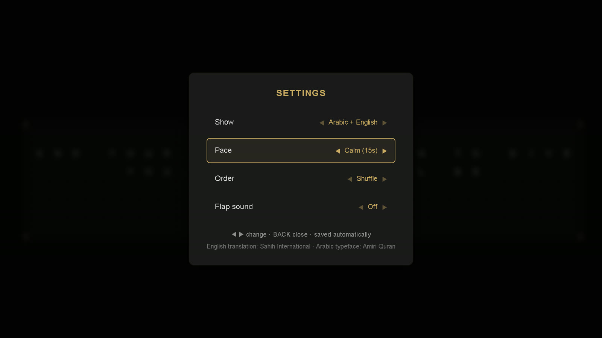
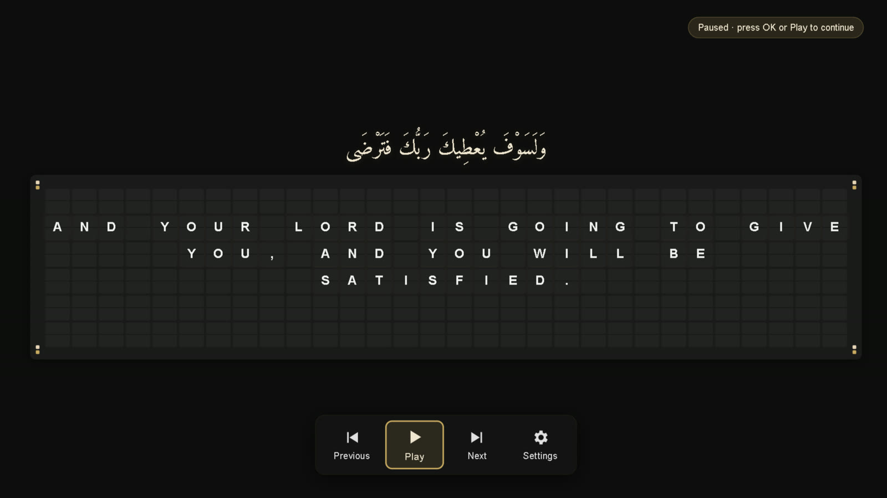
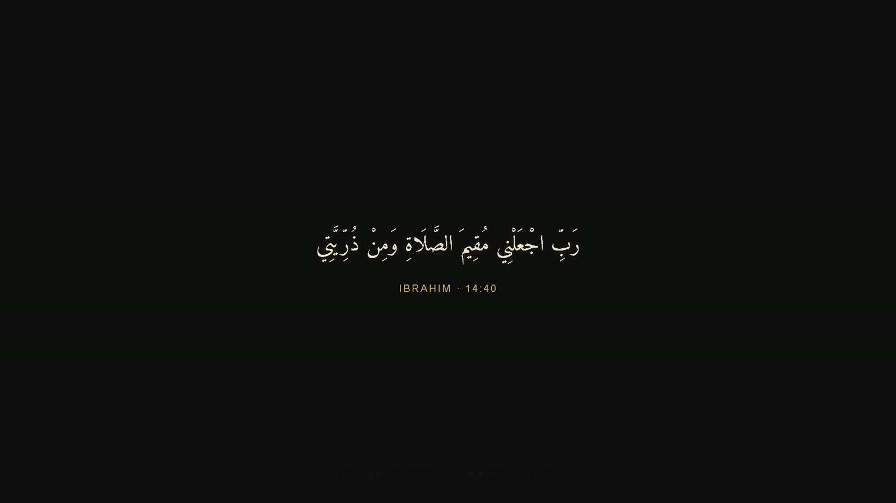

<p align="center">
  
</p>

<p align="center">
  <strong>Quran verses on a retro split-flap board. Install it on your LG TV and leave it running.</strong>
</p>

<p align="center">
  <a href="#quick-start"></a>
  <a href="#building-from-source"></a>
  <a href="LICENSE"></a>
  <a href="https://github.com/Ublaze/Quran-FlipBoard-TV/releases"></a>
  
</p>

<details>
<summary><strong>Table of Contents</strong></summary>

- [Why Quran FlipBoard?](#why-quran-flipboard)
- [Features](#features)
- [Screenshots](#screenshots)
- [Quick Start](#quick-start)
- [Remote Controls](#remote-controls)
- [Settings](#settings)
- [Running It All Day](#running-it-all-day)
- [Comparison](#comparison)
- [Building from Source](#building-from-source)
- [Testing](#testing)
- [Architecture](#architecture)
- [Contributing](#contributing)
- [License](#license)

</details>

---

**Quran FlipBoard** turns an LG TV into a calm ambient display. Each verse appears in Amiri Quran calligraphy, while its English translation clatters into place on a split-flap board, the kind you'd see in an old airport departure hall.

It starts playing as soon as it opens. There's nothing to set up, no account, and no network connection.

<p align="center">
  
</p>

## Why Quran FlipBoard?

| You want | Typical Quran apps | Quran FlipBoard |
|----------|-------------------|-----------------|
| Something beautiful on the TV when nobody is watching | Built for reading or listening, sitting on a menu | Ambient by design: starts, rotates and never stops |
| Verses readable from across the room | Phone-sized text | 10-foot layout, nothing under LG's 20 px minimum |
| No fiddling with the remote | Accounts, downloads, menus | Zero setup; four optional settings that save themselves |
| Safe for an OLED left on for hours | Static screens | Whole layout drifts a few pixels every ~12 minutes |
| Works without internet | Streams content | Fully offline: fonts, verses and sound are all bundled |

## Features

- **Autoplay that doesn't stop.** Each verse stays readable for your chosen pace, then flips to the next. A watchdog recovers automatically if anything goes wrong.
- **Stays on screen.** Asks webOS not to start the screensaver, with an automatic fallback for TVs that refuse.
- **Remembers you.** Resumes on the same verse with your settings after a relaunch or power cycle.
- **Simple controls.** OK opens a small Previous / Pause / Next / Settings bar that hides itself.
- **Magic Remote support.** Point and click anywhere; the cursor appears only while you move it.
- **113 curated verses** from 74 surahs, with full tashkeel and the Sahih International translation.
- **Three display modes:** Arabic + English, Arabic only, or English only.
- **OLED care:** slow layout drift, and no static counters.
- **Optional flap sound,** synthesised with the Web Audio API (no audio files).

## Screenshots

| Control bar (press OK) | Settings |
|---|---|
|  |  |
| **Paused** | **Arabic only** |
|  |  |

## Quick Start

### Option 1: Install the release on your TV (Developer Mode)

1. Turn on [Developer Mode](https://webostv.developer.lge.com/develop/getting-started/developer-mode-app) on the TV and register it with the webOS CLI (`ares-setup-device`).
2. Download `com.ublaze.quranflipboard_<version>_all.ipk` from [Releases](https://github.com/Ublaze/Quran-FlipBoard-TV/releases).
3. Install and launch it:

```bash
ares-install --device <your-tv> com.ublaze.quranflipboard_0.2.0_all.ipk
ares-launch  --device <your-tv> com.ublaze.quranflipboard
```

### Option 2: Try it in a browser

```bash
node build.js
python -m http.server 8765 -d dist-src
# open http://localhost:8765, press F for fullscreen
```

## Remote Controls

| Key | Main screen | Control bar | Settings |
|-----|-------------|-------------|----------|
| ◀ ▶ | Previous / next verse | Move between buttons | Change value |
| ▲ ▼ | Show control bar | Hide bar | Move between rows |
| OK | Show control bar (resumes if paused) | Press button | Change value |
| Play / Pause / Stop | Resume / pause | Resume / pause | — |
| ⏩ ⏪ / CH + − | Next / previous verse | Next / previous verse | — |
| GREEN | Open settings | — | Close |
| BACK | Exit to Home | Hide bar | Close |

Menus close themselves after 20 seconds without input, and the verses carry on.

## Settings

| Setting | Options | Default |
|---------|---------|---------|
| Show | Arabic + English · Arabic only · English only | Arabic + English |
| Pace | Quick 10 s · Calm 15 s · Slow 25 s · Very slow 45 s | Calm 15 s |
| Order | Shuffle · In order (Mushaf order) | Shuffle |
| Flap sound | On · Off | Off |

Pace is the time a verse stays fully readable. Long verses get a little extra.

## Running It All Day

Some behaviour belongs to the TV, not the app. See [docs/TV-Setup.md](docs/TV-Setup.md) for:

- **Opening at power-on:** LG gives apps no API to launch at power-on. The closest you can get is **Quick Start+** on and **Home Auto Launch** off, with the app left open when you switch off.
- **Auto Power Off:** LG turns the TV off after 4 hours with no key press unless you disable it.
- **OLED Care:** leave Screen Shift and Logo Luminance on. They work alongside the app's own drift.

## Comparison

| | Quran FlipBoard | Static wallpaper / photo slideshow | Quran reading apps |
|---|---|---|---|
| Changes verse by itself | ✅ | ❌ | ❌ |
| Readable from the sofa | ✅ | depends on the image | ⚠️ phone-sized |
| Arabic + translation together | ✅ | rarely | ✅ |
| Works offline | ✅ | ✅ | ⚠️ often streams |
| Resists OLED burn-in | ✅ drift | ❌ | ❌ |
| Setup needed | none | make the images | account / downloads |

## Building from Source

No frameworks and no npm dependencies. You need Node.js and, for packaging, the [webOS TV CLI](https://webostv.developer.lge.com/develop/tools/cli-installation).

```bash
node build.js                 # bundles js/ into dist-src/js/app.bundle.js
ares-package dist-src -o dist # creates dist/com.ublaze.quranflipboard_<ver>_all.ipk
```

`build.js` concatenates the ES modules into one script for older webOS browsers. **The build fails** if the source contains `?.` or `??`: webOS 5 runs Chromium 68, which can't parse them. (An automatic rewrite of `?.` is what froze v0.1.0. See the [CHANGELOG](CHANGELOG.md).)

## Testing

`tests/e2e.mjs` drives the **packaged bundle** in headless Chrome with real remote key codes. It has no dependencies, using Node 22+'s built-in WebSocket and the Chrome DevTools Protocol.

```bash
node build.js
python -m http.server 8765 -d dist-src   # in another terminal
node tests/e2e.mjs                        # 22 checks, ~4 minutes; screenshots in test-output/
```

It checks unattended rotation and timing, recovery from a render error, the control bar, pause/play, settings auto-close, persistence across relaunch, and display modes.

## Architecture

```
index.html ─ main.js
              ├─ VerseRotator   sequence, pace timer, holds/pause, watchdog, resume
              │    └─ Board ── Tile ×180   split-flap grid (30 × 6)
              ├─ Settings       4 options, saved via Store, idle auto-close
              ├─ ControlBar     Previous / Pause / Next / Settings
              ├─ RemoteController  key + Magic Remote routing
              ├─ TvPlatform     luna calls via PalmServiceBridge, screensaver veto
              ├─ SoundEngine    synthesised flap sound (Web Audio)
              └─ Store          localStorage, failure-safe
data/verses.js   113 verses: Arabic, English, surah, ayah
```

## Contributing

Contributions are welcome, especially verse curation, translations and testing on more webOS versions. See [CONTRIBUTING.md](CONTRIBUTING.md).

## License

Code: [MIT](LICENSE). Fonts: Amiri and Amiri Quran by Khaled Hosny, [SIL Open Font License](fonts/OFL.txt). English translation: Sahih International.
